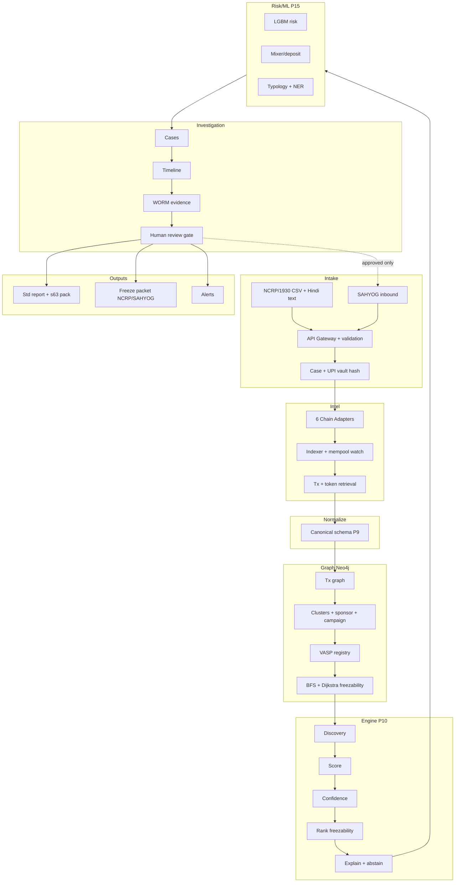

# SIH26183 — Real-Time Identification of Fraud-Linked Cryptocurrency Exchanges from Victim-Reported Suspect Wallet Addresses

## Full Problem Research & Engineering Specification (Prod-Grade, Single Build)

**Prepared for:** Smart India Hackathon 2026, Problem Statement SIH26183
**Sponsoring Organization:** Ministry of Home Affairs (MHA), via Indian Cyber Crime Coordination Centre (I4C), CIS Division
**Document type:** Research-grounded, buildable prod-grade engineering specification
**Prepared:** October 2026
**Stack lock:** Python 3.12 FastAPI + PostgreSQL 16 + Redis 7 + Neo4j 5 single-node Docker Compose. No MVP/prod split. NetworkX is unit-test helper only.
**AI/ML lock:** LightGBM + IsolationForest + logistic bridge matcher + distilled-MiniLM / distilled-MuRIL NER (custom distill; Google ships MuRIL base/large only). Total <70M params, <100MB ONNX. No 500M/1B models. GNN is ablation only.
**Chain scope:** TRON + ETH + BNB live acceptance; SOL/POL/BTC adapter-only (1 canned tx each) + open adapter. TRON-first tuning.
**Acceptance lock:** Top-1 ≥0.70, false-High =0, mixer abstain-precision ≥0.95, p95 cached ≤3s / live ≤60s / mempool replay ≤4s (REPLAY_MODE per Day-10 cut; n=100, warm 4vCPU/8GB, 10k-tx cache, MAX_HOPS=5). Core = Phases 0–26 minus EXT; EXT behind `EXT_ENABLED=false`.

### How to read this document

| Tag | Meaning |
|---|---|
| **[A]** | Explicit SIH requirement — traceable to verified PS text |
| **[A-opt]** | Explicitly stated as optional ("may include") |
| **[B]** | Reasonable engineering interpretation — needed to make [A] buildable |
| **[C]** | Proposed enhancement — our addition, buildable core differentiator, not requested verbatim |
| **[D]** | Optional/strategic — ambiguous/experimental, safe to cut, isolated in Phase 27 |

### Build scope lock (single prod-grade build — no split tracks)

- Graph store is Neo4j 5 for dev, offline demo, and acceptance build. NetworkX is unit-test helper only, never persisted.
- One prod-grade build: TRON/ETH/BNB live adapters + SOL/POL/BTC adapter-only, full token handling, provider trace endpoints, Neo4j persistence (pure Cypher BFS/Dijkstra; GDS cut Day-30), Postgres system of record, Redis cache-only (queue cut Day-20 → in-process), single-node Docker Compose.
- Cut-list: Day-30 cut GDS; Day-20 cut Redis queue; Day-10 cut mempool live → REPLAY_MODE only. EXT tables (`sponsors_ext`, `operator_cases_ext`, `upi_links_ext`) behind `EXT_ENABLED=false`; core green without them.
- Each phase states Method (how this build does it) and Limitation (explicitly out of scope). Anything in Phase 27 is not required for acceptance.

---

## PHASE 0 — Source Verification

### 0.1 Authoritative source located

Official system of record: **`https://sih.gov.in/sih2026PS`**. Direct fetch blocked by bot-detection (normal for SIH portal). This spec triangulates secondary mirrors that link back to it.

1. **`sih2026.vuce.in/ps/SIH26183`** — structured community archive (233 PS, CC-BY-4.0/MIT, unofficial). Full capture: Metadata, Background, Description, should/may, Expected Solution. Primary secondary source.
2. **`github.com/NoBugNinja/Smart-India-Hackathon-SIH-2026-Problem-Statements`** — tabular snapshot (title/org/theme).
3. **`github.com/vedantchalke36/sih-2026-problem-statements`** + search results — title/theme confirmation.

### 0.2 Cross-check results

| Field | Source 1 (vuce.in) | Source 2/3 | Agreement |
|---|---|---|---|
| PS ID | SIH26183 | SIH26183 | ✅ Match |
| Title | Real-Time Identification of Fraud-Linked Cryptocurrency Exchanges from Victim-Reported Suspect Wallet Addresses through Automated Blockchain Analytics | Identical (truncated) | ✅ Match |
| Organization | Ministry of Home Affairs | Ministry of Home Affairs | ✅ Match |
| Department | I4C, CIS Division | Not captured | — Source 1 only |
| Category | Software | Software | ✅ Match |
| Theme | Blockchain & Cybersecurity | Blockchain & Cybersecurity | ✅ Match |
| Deadline | 30 September 2026 | — | Source 1 only, verify on sih.gov.in |

No conflicting requirement text found. No official dataset/API/contract located — synthetic test data mandatory.

### 0.3 Source fidelity note

User brief is task spec, not PS copy. All **[A]** below sourced from verified PS text captured in 0.1–0.2, decomposed in Phase 1.3.

---

## PHASE 1 — Full Problem Statement Extraction

### 1.1 Metadata

| Field | Value |
|---|---|
| PS ID | SIH26183 |
| Title | Real-Time Identification of Fraud-Linked Cryptocurrency Exchanges from Victim-Reported Suspect Wallet Addresses through Automated Blockchain Analytics |
| Organization | Ministry of Home Affairs |
| Department | I4C, CIS Division |
| Category | Software |
| Theme | Blockchain & Cybersecurity |
| Deadline | 30 Sep 2026 (mirror; verify on sih.gov.in) |
| Source | sih.gov.in (official, bot-gated); sih2026.vuce.in/ps/SIH26183 (secondary used) |

### 1.2 Background — official framing + technical translation

**As SIH frames it [A]:** Victims report suspect wallets used for collection in investment scams, task-based frauds, sextortion, ransomware, phishing, darknet, organized cyber-enabled financial crimes. Wallets are often non-custodial, temporary burner, intermediary layering/laundering. Inability to quickly identify exchange/VASP delays freezing, evidence preservation, fund-flow tracing, victim recovery. Manual tracing needs expertise + time, esp. multi-chain, DeFi, mixers, bridges, privacy mechanisms.

**Translation:** wallet=keypair/address, no inherent identity. Non-custodial=no KYC custodian. Burner=short-life (<14d), funded→swept→abandoned. Intermediary/layering=relay to break tracing. Deposit address=VASP per-customer receivable. Nearest fraud-linked VASP=first VASP-controlled deposit on forward path. Burner+layering+bridge+mixer defeat naive BFS — hence weighted distance + freezability + abstention design (Phase 3).

### 1.3 Requirements decomposed

**Mandatory ("system should") [A]:**
- **REQ-001** — Ingest wallet addresses reported through cybercrime complaint systems (NCRP + SAHYOG intake).
- **REQ-002** — Automatically perform blockchain tracing outward from victim-reported wallet.
- **REQ-003** — Identify associated exchanges/VASPs (nearest fraud-linked, direct-deposit receiving).
- **REQ-004** — Detect fund movement patterns (peel, fan-out/in, layering, burner, consolidation).
- **REQ-005** — Generate actionable intelligence for investigators (ranked VASP + recommended action + evidence refs).
- **REQ-006** — Support multiple blockchain ecosystems (six named in sibling PS + open-ended; this build locks six + adapter).
- **REQ-007** — Provide real-time tracing capability (p95 seconds-scale on cached graph, mempool pre-confirmation where available).
- **REQ-008** — Provide automated investigative recommendations (freeze-first ordering, not just list).
- **REQ-009** — Provide analytics dashboards for LEAs.
- **REQ-010** — Real-time blockchain intelligence generation (Expected Solution).
- **REQ-011** — Automated VASP identification (Expected Solution restatement).
- **REQ-012** — Tracing of suspect wallets (Expected Solution).
- **REQ-013** — Cross-chain transaction analytics (Expected Solution).
- **REQ-014** — Fund-flow visualization (Expected Solution).
- **REQ-015** — Integration with LEA systems (Expected Solution).
- **REQ-016** — Generation of standardized investigation reports (Expected Solution).
- **REQ-017** — Reduce response time; improve freezing; enhance VASP coordination; strengthen evidence collection (outcome goals).
- **REQ-018** — Support API integrations (platform should further support).
- **REQ-019** — Scalable blockchain indexing (platform should further support).
- **REQ-020** — AI/ML-assisted risk detection (platform should further support).
- **REQ-021** — Automated pattern recognition for fraud typologies (platform should further support).

**Explicitly optional ("may include") [A-opt]:**
- **REQ-022 [A-opt]** — Blockchain transaction graph analysis.
- **REQ-023 [A-opt]** — Clustering of exchange wallets.
- **REQ-024 [A-opt]** — Detection of intermediary laundering wallets.
- **REQ-025 [A-opt]** — Identification of cross-chain fund movement.
- **REQ-026 [A-opt]** — Integration with SAHYOG and NCRP platforms.
- **REQ-027 [A-opt]** — Automated alert generation.
- **REQ-028 [A-opt]** — Risk categorization of wallets.

*Engineering note [B]:* REQ-022–028 are formally "may," but REQ-010/013/014/020 pull graph, cross-chain, visualization, risk back into Expected Solution. **Build all as core.** Only Phase 27 items stay truly optional.

**Outcome goals [A]:** GOAL-001 reduce response time; GOAL-002 improve freezing; GOAL-003 enhance VASP coordination; GOAL-004 strengthen evidence.

### 1.4 Capability breakdown

| Class | Items |
|---|---|
| Mandatory | REQ-001–021 |
| Implied [B] | Clustering engine; canonical multi-chain model; evidence store w/ provenance; case mgmt; RBAC; NCRP/SAHYOG adapters (contracts unpublished, isolated) |
| Optional explicit | REQ-022–028 (built as core per above) |
| Integration | NCRP + SAHYOG bidirectional (ingest + freeze-packet export); blockchain intel API layer |
| Analytics | Graph engine; risk categorization; typology recognition (ML-assisted) |
| Visualization | Fund-flow graph; campaign graph; cross-chain view; dashboard |
| Reporting | Standardized LEA reports + s.63-ready pack |
| Scale | Large-volume real-time indexing; mempool watch |

---

## PHASE 2 — Operational Problem Analysis

### 2.1 Current workflow (plausible today)
1. Victim calls 1930 / files NCRP (cybercrime.gov.in) with UPI ref, amount, suspect wallet/TxID, fake-app/Telegram context.
2. CFCFRMS lien marked on bank money if still present (~15% of reported value historically); crypto already swept via P2P→USDT-TRON in minutes.
3. IO manually queries TronScan/Etherscan/BscScan per address, one hop at a time.
4. Tribal-knowledge VASP recognition; no queryable label DB in district labs.
5. Informal ranking; screenshots as evidence; Word report; SAHYOG/notice re-keyed manually.
6. Offshore VASP ignores email; SP returns file for missing hash; victim calls daily.

### 2.2 Breakdowns
| Steps | Bottleneck | Consequence |
|---|---|---|
| 2–3 | Manual multi-chain hops, 6 UIs, internal-tx/energy invisible | Hours-days per case |
| 3–4 | No burner/sponsor/campaign view; P2P innocent seller vs scammer conflated | Wrong freeze, missed operator |
| 4–5 | No freezability ordering; nearest ≠ servable | Chase unfreezable mixer/offshore first |
| 5–6 | No hash chain, no s.63 pack, no SAHYOG-mapped fields | File returned, court rejects |

### 2.3 What SIH26183 asks to automate [B]
Compress steps 2–5 into minutes-scale pipeline: NCRP parse → forward trace → campaign expansion → freezability-ranked VASP shortlist + evidence pack + freeze-packet draft. System never auto-freezes, never proves ownership (Phase 19).

---

## PHASE 3 — Defining "Nearest Fraud-Linked VASP" + Freezability Precisely

### 3.1 Source text anchor
"Nearest exchange or VASP receiving direct deposits" + "real-time" + "reduce response time / improve freezing." Nearest = first VASP-controlled deposit on forward path. But deployable = most freezable first.

### 3.2 Two numbers, never blended
1. **Proximity distance (ranked by distance)** `weighted_graph_distance(suspect→deposit)` with `edge_cost = base + mixing_penalty + time_decay + fanout_penalty`. Method: Dijkstra on Neo4j; rank = order-by distance ascending. Limitation: not geography/volume.
2. **Freezability score** (our [C] core, prod):
```
Score(P) = I_token × R_vasp × exp(-T/48) × min(1, amt_usdt/1000)
I chain-aware: I(USDT,TRON)=1.0, I(USDT,ETH/BNB)=1.0, I(USDC,ETH/BNB)=1.0, I(USDC,TRON)=0.15 (bridged/legacy; Circle ended TRON minting Feb-2024), 0.15 BTC/XMR
R=0.90 FIU-registered, 0.55 compliant foreign, 0.10 offshore/mixer
T=hours suspect→VASP arrival; τ=48h cashout decay default (sensitivity sweep τ∈{12,24,48,96} in Phase 26)
```
Method: 40-row `vasps` table + 1 RPC blacklist check. Limitation: R/I are starting constants, calibrated only on confirmed cases.
3. **Confidence 0–100 + band** `w1 evidence_tier + w2 label_agreement + w3 reuse + w4 cluster + w5 path_integrity + w6 freshness`. Start equal weights; bands High ≥70/Med 40–69/Low <40 until 50–100 confirmed cases → logistic calibration. Factor set open (extensible vector).

**Hard rules [A/B]:** proximity + freezability + confidence always shown together. Mixer hit = hard stop, confidence 0, `insufficient_evidence` allowed. Tier 3/4 never rendered with certain language.

---

## PHASE 4 — Blockchain Coverage (prod)

| Attr | Bitcoin | Ethereum | Tron | BNB Chain | Solana | Polygon |
|---|---|---|---|---|---|---|
| Model | UTXO | Account EVM | Account TVM | Account EVM | Account ed25519 | Account EVM |
| Addr | Base58/Bech32 | Hex EIP-55 | Base58 `T` | Hex EVM | Base58 32B | Hex EVM |
| Native | BTC | ETH | TRX | BNB | SOL | POL |
| Token | — | ERC-20 | TRC-20 | BEP-20 | SPL | ERC-20 |
| Internal | Scripts | Trace/debug needed | TVM weak traces | EVM | Programs/logs | EVM |
| Deposit pattern | Fresh addr/customer, consolidate | Reused EOA/contract | Per-customer + fast sweep (fraud rail) | Mirror ETH | ATA per customer/token | Mirror ETH |
| Index | UTXO + CIO heuristic | Archive+trace | TronGrid/TronScan | BscScan | getSignaturesForAddress | PolygonScan |
| Challenge | CoinJoin | Contract-mediated | Mixer/swap, low fee, energy sponsor invisible | Bridge target | AMM program hops | Cheap bridge hop |

Method: six adapters behind `BlockchainProvider`; full ERC/TRC/SPL/BEP token universe w/ dynamic metadata; internal-tx via trace endpoints + event-log parsing; third-party indexer + Neo4j persistence. TRON-first tuning (sponsor graph, energy, SunSwap). Limitation: Solana high-volume indexing cost; TRON/ETH/BNB live, SOL/POL/BTC adapter-only per chain scope (§ Chain scope).

---

## PHASE 5 — VASP Intelligence & Evidence Hierarchy

Sources [B]: VASP-published PoR lists; FIU-IND 54 registered / 53 blocked (Mar 2026 disclosure); commercial label sets (replaceable); OFAC SDN (~1k crypto); Etherscan/TronScan/BscScan public tags; OSINT; behavioral/graph-derived (weakest).

| Tier | Name | Qualifies |
|---|---|---|
| 1 | Verified | VASP-published list, FIU/regulatory disclosure, prior confirmed disclosure for exact address |
| 2 | High | ≥2 independent commercial/OSINT/explorer agree, no conflict |
| 3 | Probable | Behavioral only (consolidation, sweep, sponsor fan) no external confirm |
| 4 | Candidate | Topology only |

Hard rule: Tier 3/4 never "belongs to X" language. UI/report/API carry tier + plain words every time.

---

## PHASE 6 — Graph Model (Neo4j prod)

Nodes: `Wallet/Address{address,chain,type,first_seen,last_seen}`, `Transaction{hash,chain,height,timestamp,fee,status}`, `Block`, `VASP{legal_name,fiu_reg,jurisdiction,contact}`, `Exchange<:VASP`, `DepositAddress`, `HotWallet/ColdWallet`, `Mixer`, `Bridge{name,src,dst,contract}`, `DeFiProtocol`, `Token`, `Chain`, `Case`, `EntityCluster`, `Sponsor{addr,chain}` [C], `OperatorCase` [C], `UpiDebit{hash,amt_paise,ts_ist,ref}` [C].
Edges: `SENDS/RECEIVES{amount,asset,timestamp}`, `INPUT_OF/OUTPUT_OF` (UTXO), `CONTROLLED_BY{confidence,tier}`, `BELONGS_TO_CLUSTER`, `DEPOSIT_TO`, `CONSOLIDATES_TO`, `SPLITS_TO{fanout}`, `BRIDGES_TO{bridge,dt,confidence}`, `SWAPS_TO{protocol,rate}`, `FUNDED_BY{trx_amt,dt}` [C] (TRON sponsor), `LINKED_VICTIM{signals}` [C], `ASSOCIATED_WITH{role}`, `OBSERVED_IN_CASE`.

Method: labeled property graph, Neo4j 5 single-node, pure-Cypher components (GDS cut Day-30). Limitation: full graph in Neo4j only; Postgres stores winning paths + case/audit.

---

## PHASE 7 — End-to-End Architecture (prod single build)



Layer duties: Intake validates chain/checksum, hashes UPI VPA (KMS-fetched salt + `salt_version`, never stores raw; per-install salt forbidden for cross-district join; offline/demo fallback `DEMO_SALT` with CANNED banner when `DEMO_MODE=true` / `EXT_ENABLED=false`). Intel normalizes behind `BlockchainProvider`. Graph builds sponsor/campaign edges (EXT-gated). Engine A–H produces ranked + abstainable list. Risk (M1 triage-only, never blocks path) consumes graph. Investigation enforces human gate (`acknowledged_by` required before packet export). SAHYOG/NCRP offline-first: `POST /ingest/ncrp-csv` + `GET /export/sahyog-packet.json` with `request_id UUID UNIQUE` replay nonce; bidirectional live sync explicitly out of scope until I4C publishes contracts.

---

## PHASE 8 — Relational Data Model (Postgres 16 DDL, prod)

```sql
CREATE TABLE investigators(investigator_id UUID PRIMARY KEY DEFAULT gen_random_uuid(), badge_id VARCHAR(64) UNIQUE NOT NULL, display_name VARCHAR(128) NOT NULL, department VARCHAR(128) NOT NULL, role VARCHAR(32) NOT NULL, is_active BOOLEAN DEFAULT TRUE, created_at TIMESTAMPTZ DEFAULT now());
CREATE TABLE cases(case_id UUID PRIMARY KEY DEFAULT gen_random_uuid(), ncrp_ack_no VARCHAR(128) UNIQUE, sahyog_case_ref VARCHAR(128) UNIQUE, title VARCHAR(256) NOT NULL, status VARCHAR(32) DEFAULT 'open', priority VARCHAR(16) DEFAULT 'medium', lead_investigator_id UUID NOT NULL REFERENCES investigators(investigator_id), opened_at TIMESTAMPTZ DEFAULT now(), closed_at TIMESTAMPTZ);
CREATE TABLE case_members(case_id UUID NOT NULL REFERENCES cases(case_id), investigator_id UUID NOT NULL REFERENCES investigators(investigator_id), role VARCHAR(32) DEFAULT 'member', PRIMARY KEY(case_id, investigator_id));
CREATE TABLE chains(chain_id SMALLINT PRIMARY KEY, chain_code VARCHAR(16) UNIQUE NOT NULL, account_model VARCHAR(16) NOT NULL, native_asset_symbol VARCHAR(16) NOT NULL);
CREATE TABLE wallet_addresses(address_pk UUID PRIMARY KEY DEFAULT gen_random_uuid(), chain_id SMALLINT NOT NULL REFERENCES chains(chain_id), address VARCHAR(128) NOT NULL, address_type VARCHAR(32), first_seen_at TIMESTAMPTZ, last_seen_at TIMESTAMPTZ, UNIQUE(chain_id, address));
CREATE TABLE tokens(token_id UUID PRIMARY KEY DEFAULT gen_random_uuid(), chain_id SMALLINT NOT NULL REFERENCES chains(chain_id), token_address VARCHAR(128), address_format VARCHAR(16) DEFAULT 'evm', symbol VARCHAR(32) NOT NULL, decimals SMALLINT DEFAULT 18, wraps_asset_id UUID REFERENCES tokens(token_id), UNIQUE(chain_id, token_address));
CREATE TABLE blocks(block_pk UUID PRIMARY KEY DEFAULT gen_random_uuid(), chain_id SMALLINT NOT NULL REFERENCES chains(chain_id), height BIGINT NOT NULL, block_hash VARCHAR(128) NOT NULL, block_timestamp TIMESTAMPTZ NOT NULL, UNIQUE(chain_id, height));
CREATE TABLE transactions(tx_pk UUID PRIMARY KEY DEFAULT gen_random_uuid(), chain_id SMALLINT NOT NULL REFERENCES chains(chain_id), tx_hash VARCHAR(128) NOT NULL, block_pk UUID REFERENCES blocks(block_pk), from_address_pk UUID REFERENCES wallet_addresses(address_pk), to_address_pk UUID REFERENCES wallet_addresses(address_pk), token_id UUID REFERENCES tokens(token_id), amount NUMERIC(38,18) NOT NULL, fee NUMERIC(38,18), tx_status VARCHAR(16) DEFAULT 'confirmed', tx_type VARCHAR(32), source_provider VARCHAR(64) NOT NULL, ingested_at TIMESTAMPTZ DEFAULT now(), UNIQUE(chain_id, tx_hash, from_address_pk, to_address_pk, amount));
CREATE TABLE transaction_inputs(input_id UUID PRIMARY KEY DEFAULT gen_random_uuid(), tx_pk UUID NOT NULL REFERENCES transactions(tx_pk), address_pk UUID REFERENCES wallet_addresses(address_pk), input_index INT NOT NULL, amount NUMERIC(38,18), UNIQUE(tx_pk, input_index));
CREATE TABLE transaction_outputs(output_id UUID PRIMARY KEY DEFAULT gen_random_uuid(), tx_pk UUID NOT NULL REFERENCES transactions(tx_pk), address_pk UUID REFERENCES wallet_addresses(address_pk), output_index INT NOT NULL, amount NUMERIC(38,18) NOT NULL, UNIQUE(tx_pk, output_index));
CREATE TABLE vasps(vasp_id UUID PRIMARY KEY DEFAULT gen_random_uuid(), legal_name VARCHAR(256) NOT NULL, fiu_ind_registered BOOLEAN DEFAULT FALSE, jurisdiction VARCHAR(64), sla_hours INT DEFAULT 72, contact_nodal VARCHAR(256), freeze_mechanism VARCHAR(128), r_score NUMERIC(3,2) DEFAULT 0.5, label_ttl_hours INT DEFAULT 168, last_verified_at TIMESTAMPTZ, verification_source VARCHAR(128), is_active BOOLEAN DEFAULT TRUE);
CREATE TABLE vasp_addresses(vasp_address_id UUID PRIMARY KEY DEFAULT gen_random_uuid(), vasp_id UUID NOT NULL REFERENCES vasps(vasp_id), address_pk UUID NOT NULL REFERENCES wallet_addresses(address_pk), address_role VARCHAR(32) NOT NULL, evidence_tier SMALLINT NOT NULL, label_source VARCHAR(64) NOT NULL, confirmed_at TIMESTAMPTZ, UNIQUE(address_pk, vasp_id, address_role));
CREATE TABLE upi_vault(entry_id UUID PRIMARY KEY DEFAULT gen_random_uuid(), upi_hash CHAR(64) NOT NULL UNIQUE, salt_version SMALLINT NOT NULL DEFAULT 1, hint VARCHAR(32), merchant_cluster_id UUID, merchant_pattern_hash CHAR(64), first_seen TIMESTAMPTZ DEFAULT now());
CREATE TABLE upi_links_ext(link_id UUID PRIMARY KEY DEFAULT gen_random_uuid(), case_id UUID NOT NULL REFERENCES cases(case_id), upi_hash CHAR(64) NOT NULL REFERENCES upi_vault(upi_hash), tx_pk UUID REFERENCES transactions(tx_pk), dt_sec INT, amt_err_pct NUMERIC(5,2), score NUMERIC(5,2), price_source VARCHAR(64), price_ts TIMESTAMPTZ);
CREATE TABLE sponsors_ext(sponsor_id UUID PRIMARY KEY DEFAULT gen_random_uuid(), chain_id SMALLINT NOT NULL REFERENCES chains(chain_id), address VARCHAR(128) NOT NULL, out_degree INT DEFAULT 0, median_trx NUMERIC, burst_std_sec INT, activation_rate NUMERIC(4,3), UNIQUE(chain_id, address));
CREATE TABLE operator_cases_ext(operator_id UUID PRIMARY KEY DEFAULT gen_random_uuid(), case_id UUID NOT NULL REFERENCES cases(case_id), collector_pk UUID REFERENCES wallet_addresses(address_pk), sponsor_id UUID REFERENCES sponsors_ext(sponsor_id), victim_count INT NOT NULL, complaint_ids TEXT[] NOT NULL, total_loss_inr BIGINT, status VARCHAR(32) DEFAULT 'candidate', created_at TIMESTAMPTZ DEFAULT now());
CREATE TABLE label_votes(vote_id UUID PRIMARY KEY DEFAULT gen_random_uuid(), vasp_address_id UUID, target_type VARCHAR(16) DEFAULT 'VASP', label_target_id UUID, new_tier SMALLINT NOT NULL, reason TEXT NOT NULL, signer_id UUID NOT NULL REFERENCES investigators(investigator_id), sig VARCHAR(256) NOT NULL, voted_at TIMESTAMPTZ DEFAULT now());
CREATE TABLE transaction_paths(path_id UUID PRIMARY KEY DEFAULT gen_random_uuid(), case_id UUID NOT NULL REFERENCES cases(case_id), suspect_address_pk UUID NOT NULL REFERENCES wallet_addresses(address_pk), hop_sequence UUID[] NOT NULL, tx_sequence UUID[] NOT NULL, weighted_distance NUMERIC(10,4) NOT NULL, freezability NUMERIC(5,3) NOT NULL DEFAULT 0, created_at TIMESTAMPTZ DEFAULT now());
CREATE TABLE attribution_candidates(candidate_id UUID PRIMARY KEY DEFAULT gen_random_uuid(), case_id UUID NOT NULL REFERENCES cases(case_id), path_id UUID NOT NULL REFERENCES transaction_paths(path_id), vasp_id UUID NOT NULL REFERENCES vasps(vasp_id), proximity_distance NUMERIC(10,4) NOT NULL, freezability NUMERIC(5,3) NOT NULL, confidence_score NUMERIC(5,2) NOT NULL, evidence_tier SMALLINT NOT NULL, status VARCHAR(32) DEFAULT 'proposed', generated_at TIMESTAMPTZ DEFAULT now(), reviewed_by UUID REFERENCES investigators(investigator_id), reviewed_at TIMESTAMPTZ);
CREATE TABLE attribution_evidence(evidence_id UUID PRIMARY KEY DEFAULT gen_random_uuid(), candidate_id UUID NOT NULL REFERENCES attribution_candidates(candidate_id), evidence_type VARCHAR(64) NOT NULL, supporting_tx_pk UUID REFERENCES transactions(tx_pk), description TEXT NOT NULL, source_provider VARCHAR(64), api_response_hash VARCHAR(128), created_at TIMESTAMPTZ DEFAULT now());
CREATE TABLE risk_assessments(risk_id UUID PRIMARY KEY DEFAULT gen_random_uuid(), case_id UUID NOT NULL REFERENCES cases(case_id), address_pk UUID NOT NULL REFERENCES wallet_addresses(address_pk), risk_score NUMERIC(5,2) NOT NULL, typology VARCHAR(64), shap_top5 JSONB, assessed_at TIMESTAMPTZ DEFAULT now());
CREATE TABLE alerts(alert_id UUID PRIMARY KEY DEFAULT gen_random_uuid(), case_id UUID REFERENCES cases(case_id), address_pk UUID REFERENCES wallet_addresses(address_pk), alert_type VARCHAR(64) NOT NULL, severity VARCHAR(16) NOT NULL, dedup_key VARCHAR(128) UNIQUE, replay_nonce VARCHAR(128) UNIQUE, mode VARCHAR(16) DEFAULT 'REPLAY', triggered_at TIMESTAMPTZ DEFAULT now(), acknowledged_by UUID REFERENCES investigators(investigator_id), acknowledged_at TIMESTAMPTZ);
CREATE TABLE investigation_events(event_id UUID PRIMARY KEY DEFAULT gen_random_uuid(), case_id UUID NOT NULL REFERENCES cases(case_id), event_type VARCHAR(64) NOT NULL, actor_investigator_id UUID REFERENCES investigators(investigator_id), event_payload JSONB, occurred_at TIMESTAMPTZ DEFAULT now());
CREATE TABLE reports(report_id UUID PRIMARY KEY DEFAULT gen_random_uuid(), case_id UUID NOT NULL REFERENCES cases(case_id), version INT DEFAULT 1, generated_by UUID REFERENCES investigators(investigator_id), content_hash VARCHAR(128) NOT NULL, file_ref VARCHAR(256) NOT NULL, signer1 UUID REFERENCES investigators(investigator_id), signer2 UUID REFERENCES investigators(investigator_id), sig1 VARCHAR(256), sig2 VARCHAR(256), day_root VARCHAR(128), kms_key_id VARCHAR(128), generated_at TIMESTAMPTZ DEFAULT now(), UNIQUE(case_id, version));
CREATE TABLE api_requests(request_id UUID PRIMARY KEY DEFAULT gen_random_uuid(), provider VARCHAR(64) NOT NULL, endpoint VARCHAR(256) NOT NULL, request_hash VARCHAR(128) NOT NULL, response_hash VARCHAR(128), status_code SMALLINT, latency_ms INT, dedup_key VARCHAR(128) UNIQUE, requested_at TIMESTAMPTZ DEFAULT now());
CREATE TABLE audit_logs(audit_id BIGSERIAL PRIMARY KEY, actor_type VARCHAR(16) NOT NULL, actor_id VARCHAR(128), action VARCHAR(64) NOT NULL, resource_type VARCHAR(64), resource_id UUID, ip_address INET, occurred_at TIMESTAMPTZ DEFAULT now());
```

Notes [B]: `audit_logs` append-only (no UPDATE/DELETE grants). Candidates never edited; re-run = new row. Full graph in Neo4j; Postgres stores winning paths for reports. UTXO: `transactions.from/to` for account chains only; Bitcoin uses `transaction_inputs/outputs`. `tokens.token_address` holds EVM hex (`address_format='evm'`) or Solana Base58 mint (`address_format='spl'`). Row-level case ACL via `case_members`; `lead_investigator_id` is owner. `label_votes.target_type/label_target_id` covers VASP/Mixer/Bridge/DeFi (`vasp_address_id` kept for back-compat). `attribution_candidates.proximity_distance` is weighted distance; rank = order-by ascending. Per-case linear hash chain + daily Merkle `day_root` batch coexist (chain per case, Merkle over day manifests).

---

## PHASE 9 — Canonical Schema
Same seven core fields (`chain, block_height, timestamp, tx_hash, sender, recipient, amount`) + `asset, fee, tx_status/type, input_output{model,utxo_*}, contract_interaction, provenance{source_provider,ingestion_timestamp,confirmation_state,raw_response_hash}, chain_specific_metadata{gas,nonce,energy,permission}` as JSONB. TRON sponsor/energy + permission deltas preserved, never flattened.

## PHASE 10 — Attribution Engine (A–H, prod)
A Discovery: forward BFS exhausts `MAX_HOPS=5` budget (never first-hit stop) to enumerate all `DEPOSIT_TO` candidates. B Traversal: temporal-ordered path materialization. C Filtering: drop dust/poison duplicates, high-degree non-deposit hubs, mixer dead-ends (hard stop). D Evidence: label/cluster/consolidation/sponsor/campaign signals → `attribution_evidence`. E Proximity: Dijkstra weighted distance over the enumerated subgraph (canonical path = Dijkstra minimum-cost, not BFS minimum-hop). F Confidence+Freezability: independent scores; empty/low allowed → `insufficient_evidence`. G Ranking: sort by freezability-adjusted proximity (order-by `proximity_distance` ascending); show all three numbers. H Explainability: hop/amount/time/hash/tier/why-lower + SHAP top-5. Rules: rank/confidence/freezability never blended; Tier3/4 hedged language enforced in templates.

## PHASE 11 — Graph Algorithms (prod)
Use: BFS discovery, Dijkstra proximity/freezability, temporal constraint, components (pure Cypher; GDS cut Day-30), CIO/change + behavioral clustering, centrality as feature, sponsor fan-out, campaign backward expansion [C EXT-gated]. Runtime: pure-Cypher enumeration + Python over Neo4j result sets (degree/fanout centrality, CIO heuristic, 2-hop campaign expansion); NetworkX test-only, GDS not used. Optional [D]: Louvain, flow, motifs (risk layer only). No GNN in core (Phase 16 ablation only).

## PHASE 12 — Campaign Graph [C EXT-gated] (differentiator, prod-stretch)
From collector `S`: in-neighbours `|Δt| 3–14d, amt 0.5–2x` + share ≥2 of {same S, same sponsor F, same 24h IST bucket, same app string ≥0.85} → keep. `≥3 victims = candidate-operator; ≥8 victims + ≥2 complaints = confirmed-operator` → `operator_cases_ext` (`status` candidate/confirmed). Ban single-signal merges (shared P2P merchant or shared VASP alone never merges); innocent-seller exoneration via escrow-timing + bidirectional P2P history → exclude. Sweep victim-count 3–20 + Δt 1–30d with PR-AUC/Precision@k/false-merge on hot-wallet negatives required. Method: Neo4j 2-hop constrained BFS + NCRP join, `EXT_ENABLED=true` only. Limitation: needs ≥2 complaints for confirmed; single-victim demo uses canned `campaign_47.json` with CANNED banner.

## PHASE 13 — TRON Sponsor Graph [C EXT-gated] (prod-stretch)
Edge `SPONSOR—FUNDED→MULE` if TRX-in precedes first USDT-in 0–72h (TronGrid `transactions?only_to`, `getaccount`). Rule `out_degree≥10 + median 5–50 TRX + burst<6h + activation>0.7` → operator candidate; 5-dim IsolationForest for shift; 50+ exchange/energy-market allowlist (Binance hots, TronNrg/TokenGoodies, JustLend, SunSwap routers) checked BEFORE scoring; require `FUNDED 0–72h + ≥3 mules→same VASP deposit 14d + activation>0.7`. 500-sponsor eval (operator vs exchange/energy/dapp, train<pre-2025/test post-2025, sponsor-precision@k + FPR) required. Claim only "TRON sponsor mule recall on NCRP sample." Method: crawler + Neo4j + IF, `sponsor_cache.parquet` pre-fetched, live top-5 cap 5s timeout → cache fallback. Limitation: free-tier 5 QPS; offline cache mandatory for demo.

## PHASE 14 — Cross-Chain (prod)
`BRIDGES_TO` on bridge-contract receipt (X) + mint/release (Y) matched by `|amt-fee|<tol + Δt 2min–2h + asset + contract`. `BRIDGE_DECAY=0.8/hop`, max 2 hops else `insufficient_evidence`. Per-bridge fee/time table versioned CSV. Reference bridge list tiered like labels. Limitation: 0.8 starting default.

## PHASE 15 — Mixers/DeFi/Bridges handling
Mixer = hard stop, "downstream not established," never guessed. DEX swap = transparent `SWAPS_TO`, tracked through. Batching decomposed per-output. Peeling via fanout_penalty. Fan-in = positive sweep signal. Fan-out = multi-candidate. Unlimited `approve(2^256-1)` + permission-weight trap + energy-delegation hijack flagged as separate detectors (TRON decoders, allowlisted routers).

## PHASE 16 — AI/ML (locked small stack, prod, triage-only)
- **M1 Risk LGBM 35 feats** (degree/amount/temporal/motif-risk): Elliptic++ + BABD + OFAC overlay + ScamSniffer; 300 trees d7; 680KB; CPU 4.5min / T4 1.2min; infer ~40ms; protocol frozen train<2023-06/val 06–09/test>2023-09 + 5k TRON holdout (500 human-audited); report PR-AUC + Precision@k=1,5 + ECE/MCE + reliability + SOTA table (LGBM vs baseline vs SAGE vs rule-only); temporal F1 ~0.74 target. SHAP top-5 + isotonic calibration. M1 triage-only, never blocks attribution path. [A/B for REQ-020/021/028]
- **M2 Mixer/deposit binary** (same stack + denomination/gas/relayer): precision >0.95 threshold, abstain-precision on mixer ≥0.95 required.
- **M3 Bridge logit** (Δt, Δamt, fee-fit): Recall@1 0.70–0.85, <1ms; per-bridge versioned fee/time CSV; TRON→BSC BitTorrent scoped claim only.
- **M4 Typology XGB 3-class + NER distilled-MiniLM / distilled-MuRIL int8 20–66M** (custom distill; Google ships MuRIL base/large only) (regex `0x…/bc1…/T…/txid64` + 10k NCRP sents dual-annotated, κ reported, Hindi/Hinglish split, regex vs MiniLM vs MuRIL-base table, 1–3h T4, F1 0.75–0.85 gated behind 500-call 1930 eval flag).
- **Sponsor IF** (5 feats, 100 trees, 40s CPU).
- **Ablation pre-registered:** seeds×5, same temporal split, McNemar; SAGE-2L (~0.69) and tiny transformer (+0.005, +320MB) documented as loses/not-worth. No 500M/1B: needs 50M+ pairs (have 24k), 100s A100-h, 4GB weights, hallucinates, inadmissible. Total shipped <100MB ONNX, ~5h T4 ($3–5). Limitation: BTC/ETH-skewed, TRON thin — weak-label factory + 10–20% synthetic required.

## PHASE 17 — UPI+Chain Join [C EXT-gated] (prod-stretch)
Normalize NCRP → `SHA256(KMS_salt||vpa_norm)` with `salt_version` (KMS-fetched at boot, versioned in packet; per-install salt forbidden; offline/demo fallback `DEMO_SALT` with CANNED banner when `DEMO_MODE=true` / `EXT_ENABLED=false`). Join requires 3-way: `|amt_fiat-amt_chain×price_minute|<2% + 0<dt<45min + same merchant cluster (`upi_vault.merchant_cluster_id / merchant_pattern_hash`; exact hash equality alone is insufficient)` via versioned minute candle (`price_source/price_ts` stored); else `manual-link` UI state only. Claim "dual-ledger race indicator (lien futile vs viable)," never "UPI proves ownership." Dual-ledger "race lost/won" (sweep < complaint+2h → lien futile, pursue issuer/VASP). Limitation: needs NCRP timestamp + price feed; degrades to manual-link visibly.

## PHASE 18 — Mempool Interceptor [C EXT-gated] (prod-stretch, TRON degraded)
Watchlist hashmap + WS (`alchemy_pendingTransactions`, `mempool.space/ws`) + 2s TronGrid poll fallback (TRON `poll:degraded` badge, never LIVE) + `REPLAY_MODE` canned 500-line log at 5tx/s. Dedup `dedup_key UNIQUE + replay_nonce`, `mode LIVE/POLL/REPLAY` badge always visible; `acknowledged_by` required before packet export. Budget 1–4s vs 60–600s confirmed. Auto-fallback LIVE→POLL→REPLAY on 5s timeout; Day-10 cut = REPLAY only. Limitation: TronGrid pending undocumented — poll-based, rate-limited.

## PHASE 19 — Dashboard (prod)
Cases (priority/status/chain/VASP/risk/activity + top candidate band); Wallet (balance/count/first-last/flow by cluster + candidate panel); Fund-flow graph (mixer dead-end marker, bridge dashed break); Attribution panel (VASP, band+tier, path, txs, sources); Cross-chain view (per-hop decay); Campaign view (S→siblings→complaints→loss sum) [C]; Timeline (`investigation_events`); Evidence view (every number → evidence rows).

## PHASE 20 — Reports + s.63 Pack (prod)
Std contents [A REQ-016]: case/IO/wallets/chains/summary/paths/candidates(rank/conf/tier)/hashes/times/amounts/intermediaries/graph image/method/limits/sources/version/hash. Three-way split enforced: Facts / System inferences / Analyst conclusions (empty until signed). Plus [C]: `evidence_pack.zip` (`records.jsonl` + `sha256_manifest{record,sha,ts,collector,provider,endpoint,params}` + `s63_draft.pdf` s.63(2)(a)-(d) + Merkle `day_root` + Ed25519 dual-sig via `POST /reports/{id}/sign` reviewer+MFA only + KMS `kms_key_id` ceremony doc + `verify.py`). Key ceremony + `closed_at` retention job required. WORM storage; versioned, never overwritten. Solana capped 1-hop (per-chain hop override).

## PHASE 21 — Auditability
`audit_logs` append-only; `source_provider` + `response_hash` + `ingested_at` vs `block_timestamp`; candidates never edited; reports versioned; hash chain `report→candidate→evidence→tx→api_response` per case, plus daily Merkle `day_root` batch over day manifests (Phase 20). Tamper 1 byte → VERIFY red.

## PHASE 22 — Security (prod)
JWT + RBAC (investigator/reviewer/admin, row-level case ACL via `case_members`), MFA reviewer/admin, mTLS internal, TLS1.2+, at-rest encryption, Vault/KMS secrets (never .env), per-user rate limits, SAHYOG replay nonces, strict address-regex before any query/shell, export watermark + gate. Threat table: insider cross-case, evidence tamper, report tamper, spoofed routing (human gate), provider poison (multi-source + hash trace), SSRF (allowlisted endpoints), injection (parameterized), exfiltration (logged/gated).

## PHASE 23 — Legal/Governance (not legal advice)
PMLA Mar-2023 reporting-entity + FIU-IND KYC; FIU Oct-2025 offshore blocking; SAHYOG §79(3)(b) + Phase-2 data-request (contract unpublished → isolated adapter); litigation noted. Separation enforced: ranked list ≠ freeze/warrant/proof; VASP ≠ beneficial owner; routing draft ≠ compulsion; cross-border flagged, no auto MLAT. Retention per LEA policy (`closed_at` jobs). Artifacts: PMLA s.17(1A)/s.8 + BNSS s.106/185 + FIU STR drafts EN/HI, marked DRAFT needs SP sign; `vasp_directory{entity,jurisdiction,fiu,sla,contact,mechanism,R}`; CFCFRMS/SAHYOG bridge (`ncrp_ack,lien_status,79_3b_ref,payload export`); quorum 2-of-3 label flips + innocent-seller escrow-timing exoneration. Avoid: "auto-freeze," "prove ownership," "guarantee recovery/admissible."

## PHASE 24 — Providers (prod)
Landscape: Chainalysis/Elliptic/TRM (enterprise, partnership-only); Merkle (inquire trial); Etherscan-family/BscScan/PolygonScan (free, rate-limited); Blockchair; TronGrid/TronScan (necessary); Solscan/Helius; Bitquery GraphQL; Alchemy/Infura/QuickNode (infra, no labels). Reality: raw via free explorer/RPC + self-assembled labels (OFAC + PoR + public tags + GraphSense/WalletExplorer-style + ScamSniffer MIT) as starter, swappable for licensed feed — state explicitly. `BlockchainProvider{get_transactions,get_address_labels,get_token_transfers,get_block}` + six concretes; canonical-out only downstream.

## PHASE 25 — Offline/Demo + Test Data (prod)
`DemoBlockchainProvider` same interface, `DEMO_MODE=true`, zero live calls, same engine paths. Acceptance 6 cases: direct, 1-hop, multi-hop, mixer hard-stop (abstain), bridge degraded, false-hub filtered; each with input addr + expected VASP + expected band + max hops; pass 5/6 + 0 High false. Stretch: ambiguous insufficient, campaign-operator, sponsor-operator (EXT). Canned `campaign_47.json + upi_link.json + sponsor_cache.parquet + canned_mempool.log` + `SHA256SUMS+verify.sh` 2GB kit. Doubles as eval suite. `docker compose up + seed` must work offline; no cold-start on stage.

## PHASE 26 — Evaluation + Scale + Config (prod lock)
Metrics: Top-1 ≥0.70 / Top-3, P/R/F1, false-High =0, mixer abstain-precision ≥0.95, MRR/NDCG, path/hop accuracy, missed-path rate, bridge Recall@1, typology macro-F1, NER F1, p95 cached ≤3s / live ≤60s / mempool replay ≤4s (REPLAY_MODE per Day-10 cut; rig: 10k-tx Neo4j cache, 4vCPU/8GB warm, n=100, MAX_HOPS=5, per-chain Solana 1-hop). Freezability sensitivity τ∈{12,24,48,96} (default τ=48 in Phase 3 formula) + Brier/reliability required post-50 cases. Scale: Neo4j single-node pure-Cypher + Postgres16 + Redis cache-only, Parquet caches, SQLite FTS, <2GB district kit w/ `SHA256SUMS+verify.sh`. VASP Tier1 TTL 168h auto-demote Tier1→Tier3 via cron. Owners: 2 intel/indexer, 2 engine/graph, 1 API/report, 1 demo/devops. Config via pydantic-settings (`.env` never committed): `DEMO_MODE, EXT_ENABLED=false, SECRET_KEY, POSTGRES_*, REDIS_*, NEO4J_*, ATTRIBUTION_MAX_HOPS=5, BRIDGE_DECAY=0.8, PROVIDER_*_ENABLED, SAHYOG_*, NCRP_*, KMS_SALT_VERSION`. Deploy: `docker compose up --build; alembic upgrade head; make seed-demo; pytest`. Python 3.12, 4vCPU/8GB rec.

## PHASE 27 — Optional / Ambiguous Feats [D] (isolated, cuttable, not for acceptance)

> Everything here is explicitly non-required. Each ships behind a flag/adapter, never on mandatory path. Cut under time pressure with zero core regression.

- **D-01 APK-to-chain tripwire:** `apktool + regex(0x…|T…)` → Jaccard across FIR corpus; needs victim APK URLs + VirusTotal free; corpus-dependent, AV-evasive. Flag `APK_TRIPWIRE_ENABLED`.
- **D-02 Honeypot drainer tripwire:** 20 decoys/theme on paste-sites/P2P ads + polling watcher; operational risk (lure management), false-lure review needed. Flag `HONEYPOT_ENABLED`.
- **D-03 1930 audio intake:** Hindi/Hinglish ASR + NER to NCRP fields; WER on phone audio, speaker/PII risk, needs consent flow. Adapter only, original audio hashed, never repo-stored.
- **D-04 Patrol optimizer (knapsack):** `value=P×R0×amt×velocity/hours_to_dissipate / filing_cost`; staff-slot constraint; weight-tuning subjective. UI-only rank, never auto-files.
- **D-05 Guardrailed LLM explainer:** LLM writes *plain-English summary only* from Stage-H JSON, never new attribution; citations to tx hashes required, temp 0, offline small instruct model; hallucination eval required. Never on evidence path.
- **D-06 Federated district learning:** nightly LGBM retrain on `verdicts.db` merges; quorum 2-officer flips, 5/day cap, poison audit; needs multi-site deployment to matter.
- **D-07 Full GNN ranker:** 2–8 layer SAGE/GAT; needs 100+ confirmed cases + explainability waiver; ablation-only until beats LGBM temporally.
- **D-08 Real-time issuer auto-freeze:** direct Tether/Circle blacklist calls; legal-authority gated, never auto-executed in build — draft + human sign only.

*Acceptance depends on Phases 0–26 only. Phase 27 demos only if core green.*
